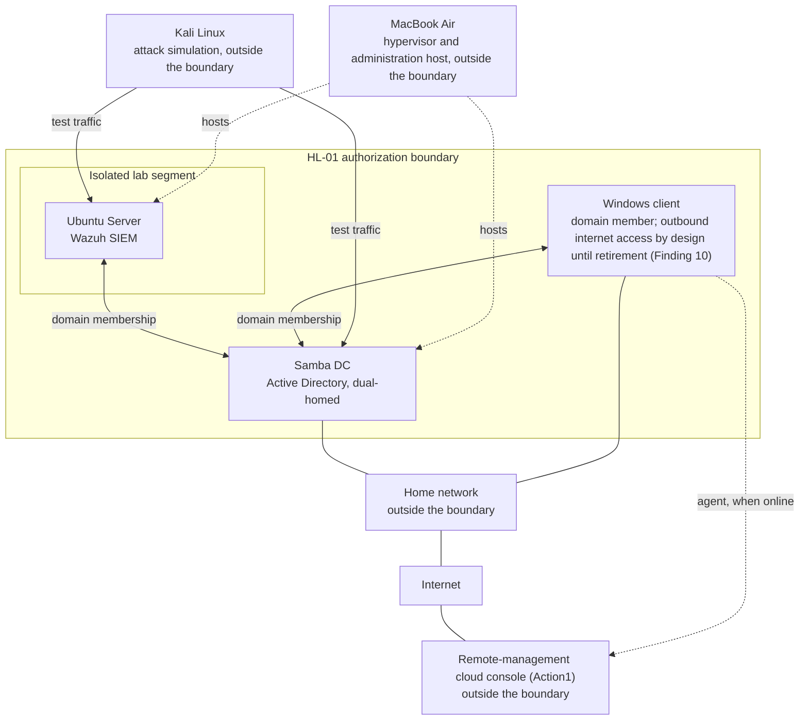

# System Security Plan — Cybersecurity Home Lab (HL-01)

A system security plan for a single-operator security lab, developed with the NIST Risk Management Framework (SP 800-37 Rev 2) and structured to the SP 800-18 Rev 2 Security Plan Example Outline. Identifying values are replaced or redacted, as the outline provides: *"Redact sensitive system information as required."*

**Plan status:** control selection and tailoring complete; assessment of the nine controls named by Findings 1–9 (AC-3, AC-7, CA-3, CM-7, SA-9, SA-22, SC-7, SI-2, SI-3) complete. Plan approval and authorization decision not issued (§4).

---

## 1. System Name and Identifier

| Element | Value |
|---|---|
| System name | Cybersecurity Home Lab |
| System identifier | HL-01 |
| Historical names | None |

---

## 2. System Overview

**Purpose.** HL-01 supports three functions: **detection** (a Wazuh SIEM), **identity services** (a Samba Active Directory domain), and **evidence production** (command output, alert records, packet captures, and assessment and incident documentation).

| Characteristic | Value |
|---|---|
| Environment type | Testing and training |
| Implemented technology | On-premises: two virtual machines (VMware Fusion on a macOS host) and one physical workstation |
| System exposure | Isolated for the lab segment; restricted for the home-network side |
| System criticality | Mission-critical to its own three functions |
| Ownership | Privately owned and operated by a single individual |
| Common control provider | None. No controls are inherited from the MacBook Air (macOS; hypervisor and administration host) outside the boundary. |

**Users.** One operator administers every component over SSH (the Windows client's SSH log: [evidence appendix §15](evidence-appendix.md#15-ssh-administration-of-the-windows-client)). The directory also holds test accounts used in exercises. No data about real individuals is processed.

**Factors presenting additional risk:**

- The Samba DC is dual-homed across the lab segment and the home network, and runs no host firewall (Finding 2).
- Kali Linux (attack simulation) shares the lab segment with Ubuntu Server (SIEM) and the Samba DC by design.
- Ubuntu Server is configured to accept cached domain logons (Finding 7).
- The Windows client was designed to have no internet access, but that isolation was not in effect: the client had a path to the internet with name resolution disabled (Finding 10). On September 29, 2026, the system owner changed the design: the client keeps outbound internet access until it is retired (`poam.md` P-07).
- On October 1, 2026, the system owner decided to retire the Windows client early, without remediating it. It stays in the boundary and the component inventory, powered off, until its disposal is verified (`poam.md` P-17).
- The Windows client runs an operating system past its end of support (Finding 8).
- The Windows client runs an external remote-management agent (Action1) (Finding 9).
- The Windows client runs an application Microsoft classifies as adware (Finding 11).
- Neither server has malicious code protection meeting the approved values (Finding 12).
- The Samba DC lists its file shares and every domain user account to anonymous requesters on the lab segment (Finding 13).

---

## 3. Laws, Regulations, and Policies

**Laws and regulations: none identified.** HL-01 is a privately owned, nonfederal system that processes no federal information and no data about individuals. SP 800-18 Rev 2 §1.1: *"Nonfederal organizations — including private and small businesses, academic institutions, and state, local, and tribal governments — may utilize the guidelines provided in this publication to support their risk management programs."*

**Policies: none issued.** Technical settings, such as the domain password and lockout policy and the host firewall defaults, are configured on the components but are not issued as organizational policy. No rules of behavior (PL-4) have been issued.

**Standards applied voluntarily:**

| Publication | Used for |
|---|---|
| NIST SP 800-37 Rev 2 | Risk Management Framework steps and tasks |
| FIPS 199 (February 2004); NIST SP 800-60 Vol 1 Rev 1 | Security categorization |
| NIST SP 800-53 Rev 5 (Release 5.2.0) | Control catalog |
| NIST SP 800-53B (Release 5.2.0) | Control baselines and tailoring |
| NIST SP 800-53A Rev 5 (Release 5.2.0) | Control assessment procedures (`security-assessment-plan.md`) |
| NIST SP 800-18 Rev 2 | System plan elements and structure |

---

## 4. System Status

| Element | Status |
|---|---|
| System security plan approval | Not issued. Select step complete; plan approval (SP 800-37 Rev 2 Task S-6) is pending Authorizing Official review (§5). |
| Authorization decision | Not issued |
| Operational status | In operation, not authorized. SP 800-18 Rev 2 defines "Operational" as *"The authorized system is operating in the operational environment"* and provides that *"Organizations may use other operational status indicators as needed …"* |

---

## 5. Roles

| Role | Assigned to |
|---|---|
| System owner; information owner; system security officer | Jason Mason |
| Authorizing Official | Not designated |
| Control assessor | System owner (self-assessment; security assessment plan §2) |

**Why no Authorizing Official is designated.** SP 800-37 Rev 2 Task P-1: *"authorizing officials cannot occupy the role of system owner … for systems … they are authorizing."* This single-operator system has no one else to fill the role. Every Authorizing Official decision — categorization approval, plan approval, acceptance of risk for tailored-out controls, and authorization — is recorded as pending review or not issued, never as made.

**Separation of duties.** One person holds every role. The SP 800-18 Rev 2 supplement *System Plan-related Roles and Responsibilities*: *"When multiple roles are fulfilled by the same individual, additional considerations for the separation of duties may require compensating controls that are documented in the system plan."* This is addressed under AC-5 in tailoring (§10.2).

**Contact:** GitHub, `JSON-MSON`.

---

## 6. Security Categorization

### 6.1 Information types

Organization-identified (SP 800-60 Vol 1 Rev 1 §4.1.4); provisional impact levels from SP 800-60 Vol 2 Rev 1 were not used.

| Information type | Confidentiality | Integrity | Availability | Basis |
|---|---|---|---|---|
| 1. Identity and authentication data | HIGH | HIGH | HIGH | Disclosure of the key that signs Kerberos ticket-granting tickets lets an attacker forge authentication for any account in the domain (MITRE ATT&CK v19.2, T1558.001); identity services is a primary function. |
| 2. Security event and audit log data | LOW | MODERATE | MODERATE | A documented log truncation destroyed the live log for a bounded period; its content survived in the detection record, and detection was not disabled. |
| 3. Network traffic capture data | LOW | LOW | LOW | Completed exercise; the captured credential is a non-functioning test value. |
| 4. System configuration data | MODERATE | HIGH | MODERATE | Unauthorized change leaves a control that appears active while no longer functioning. |
| 5. Assessment and incident documentation | MODERATE | HIGH | MODERATE | Every downstream artifact inherits what this documentation records. |

Each rating uses FIPS 199 impact definitions, applied to degradation of mission capability.

### 6.2 System security category

Per the FIPS 199 high-water-mark rule (SP 800-60 Vol 1 Rev 1 §4.4.1), each objective takes the highest level rated for any information type. Type 1 sets HIGH on all three. The adjustment factors of SP 800-60 Vol 1 Rev 1 §4.4.2 were reviewed; none changes a result already at the ceiling of the scale.

```
SC Cybersecurity Home Lab = {(confidentiality, HIGH), (integrity, HIGH), (availability, HIGH)}
```

**Overall impact level: HIGH.** Categorization approval (Task C-3) is pending Authorizing Official review.

---

## 7. Authorization Boundary

Three components across two network segments. The boundary follows SP 800-37 Rev 2's definition: *"All components of an information system to be authorized for operation by an authorizing official. …"*

| Component | Type | Role | Network placement |
|---|---|---|---|
| Ubuntu Server | Virtual machine, Ubuntu Server LTS | Wazuh manager, indexer, and dashboard; domain member | Lab segment only; no route off it |
| Samba DC | Virtual machine, Ubuntu Server LTS | Samba Active Directory: directory, Kerberos, DNS | Dual-homed: lab segment and home network |
| Windows client | Physical, Windows 10 Pro | Domain client | Home network, via Wi-Fi; outbound internet access by design until retirement (Finding 10) |

| Excluded | Reason |
|---|---|
| Kali Linux | Generates test traffic against the system; holds none of its information types |
| MacBook Air | Hosting infrastructure for the two virtual machines; the operator administers every component from it over SSH |
| The rest of the home network | Two boundary components connect to it; the network itself is outside the boundary |



---

## 8. Information Exchanges

No information exchange agreements exist; none of the connected systems is separately authorized.

| Counterpart | Components | What crosses the boundary | Security consideration |
|---|---|---|---|
| Home network | Samba DC; Windows client | Every directory service is reachable from the home network | No host firewall on the Samba DC (Finding 2) |
| Internet | Samba DC; Windows client | Outbound paths exist through the home gateway; inbound reachability from the internet was not examined. The Windows client keeps outbound internet access until it is retired (§2; `poam.md` P-07). | Unfiltered outbound path; unsupported client operating system; name resolution disabled on the client (Findings 2, 8, 10) |
| MacBook Air | All components | Administration over SSH; evidence copied out for publication | Published evidence is redacted |
| Kali Linux | Ubuntu Server; Samba DC (lab-segment interface) | Hostile test traffic, by design | A host-specific firewall rule denies it SSH to Ubuntu Server |
| Remote-management cloud console (Action1) | Windows client | Outbound inventory; inbound software deployments | External service with deployment capability and no agreement (Finding 9) |

---

## 9. System Component Inventory

Captured live from each component and from the virtual machine configuration files. Exact versions are held in the operator's working records. The Windows client's retirement was decided on October 1, 2026; it is powered off and stays in this inventory until its disposal is verified (`poam.md` P-17).

| Component | Hardware | Operating system and support status | Key software |
|---|---|---|---|
| Ubuntu Server | VMware virtual machine, arm64, 2 vCPU, 6 GB; virtual EFI supplied by the MacBook Air (outside the boundary), Secure Boot not enabled | Ubuntu Server 26.04 LTS; supported | Wazuh 4.14, OpenSSH, Samba winbind, ufw |
| Samba DC | VMware virtual machine, arm64, 2 vCPU, 4 GB; virtual EFI supplied by the MacBook Air (outside the boundary), Secure Boot not enabled | Ubuntu Server 26.04 LTS; supported | Samba Active Directory domain controller, MIT Kerberos tools, OpenSSH, ufw (inactive) |
| Windows client | Apple Mac mini (Boot Camp; [evidence appendix §14](evidence-appendix.md#14-boot-camp-on-the-windows-client)) | Windows 10 Pro 22H2; past end of support (October 14, 2025) | OpenSSH server, Microsoft Defender Antivirus, a remote-management agent (Action1), an application classified as adware (Finding 11) |

---

## 10. Control Selection and Tailoring

### 10.1 Control selection (SP 800-37 Rev 2 Task S-1)

**Baseline: SP 800-53B HIGH.** SP 800-53B §2.2 defines *"a high-impact system"* as *"a system in which at least one security objective is high"*, and *"The organization selects one of three security control baselines from Chapter Three corresponding to the low-impact, moderate-impact, or high-impact categorization of the system."* HL-01 is HIGH on all three objectives (§6.2).

**370 controls and control enhancements are selected** — 188 base controls and 182 enhancements across 18 families. The Program Management and Personally Identifiable Information Processing and Transparency families have no HIGH-baseline entries. The privacy baseline is not selected: the system processes no data about individuals. The SP 800-53 Rev 5 (Release 5.2.0) Summary of Changes records that SP 800-53B (Release 5.2.0) *"has no changes"*, and that the three controls and enhancements the release adds, and the one enhancement whose requirement it revises, are each *"not included in any SP 800-53B baseline."*

| Family | Selected | Family | Selected |
|---|---|---|---|
| Access Control | 46 | Media Protection | 10 |
| Awareness and Training | 6 | Physical and Environmental Protection | 25 |
| Audit and Accountability | 25 | Planning | 7 |
| Assessment, Authorization, and Monitoring | 14 | Personnel Security | 10 |
| Configuration Management | 32 | Risk Assessment | 11 |
| Contingency Planning | 35 | System and Services Acquisition | 21 |
| Identification and Authentication | 26 | System and Communications Protection | 30 |
| Incident Response | 18 | System and Information Integrity | 28 |
| Maintenance | 12 | Supply Chain Risk Management | 14 |
| | | **Total** | **370** |

**Baseline assumptions (SP 800-53B §2.3)**, checked against this system. SP 800-53B: *"If any of the above assumptions are not valid, then some of the security controls allocated to the control baselines in Chapter Three may not be applicable—a situation that can be addressed by applying the tailoring guidance in Section 2.4 and the results of organization- and system-level risk assessments."*

| Assumption | Holds? | Evidence |
|---|---|---|
| Information is relatively persistent (*"utility for a relatively long duration (e.g., days, weeks)"*) | Yes | Directory and alert records are ongoing; exercise captures are retained. |
| Systems are multi-user, serially or concurrently | By account, not by person | One operator; several administrative accounts and directory test accounts. |
| Some information is not shareable with other authorized users | Yes | Administrative accounts are separate from test accounts; file permissions enforce the split (one set of file modes is broader than the captures', Finding 5). |
| Systems are networked and general purpose | Yes | Three components on two segments; general-purpose operating systems. |
| The organization has the structure, resources, and infrastructure to implement the controls | No | One individual holds every role and no policy is issued. SP 800-53B footnote 22 names this case for small nonfederal entities, which *"may not be large enough or sufficiently resourced to have elements dedicated to providing the range of security or privacy capabilities that are assumed by the baselines."* |

| Assumption not addressed by the baselines | Applies? | Evidence |
|---|---|---|
| Insider threats exist within the organization | No | No personnel other than the system owner. |
| Classified information is processed | No | Nonfederal; no federal information. |
| Advanced persistent threats exist within the organization | Not established | No system risk assessment has been developed. |
| Information requires specialized protection under legislation, directives, regulations, or policies | No | None identified (§3). |
| Systems communicate across different security domains | Yes | A security domain is *"a domain that implements a security policy and is administered by a single authority"* (SP 800-53 Rev 5 glossary). The Windows client exchanges data with an externally administered cloud console, and two components reach the internet. |

SP 800-53B: where these apply, *"additional controls from [SP 800-53] are likely needed to ensure adequate protection—a situation that can also be effectively addressed by applying the tailoring guidance in Section 2.4 (specifically, security control supplementation) and the results of organization- and system-level assessments of risk."*

### 10.2 Tailoring (SP 800-37 Rev 2 Task S-2)

**Result: 290 controls in the tailored baseline** — 370 selected, 81 tailored out, 1 added. SP 800-53B §2.4 requires that *"Every control from the selected control baseline is accounted for by the organization. If certain controls are tailored out, the rationale is recorded in the system security and privacy plans …"* Every control's disposition is listed at the end of this section.

| Family | Selected | Tailored out | Added | Tailored baseline | Basis for tailoring |
|---|---|---|---|---|---|
| Access Control | 46 | 5 | — | 41 | Single operator; no mobile devices; no public content; separation of duties compensated |
| Awareness and Training | 6 | 6 | — | 0 | Single operator — no workforce for awareness or role-based training programs; contingency and incident response training (CP-3, IR-2) is retained for the operator |
| Audit and Accountability | 25 | 1 | — | 24 | No automated physical access monitoring records to correlate with |
| Assessment, Authorization, and Monitoring | 14 | 3 | — | 11 | No independent assessor available |
| Configuration Management | 32 | 1 | — | 31 | No separate security representatives |
| Contingency Planning | 35 | 16 | — | 19 | No alternate site or telecommunications provider |
| Identification and Authentication | 26 | 10 | 1 | 17 | No PIV credentials, external users, or identity proofing; IA-5(13) added |
| Incident Response | 18 | 1 | — | 17 | No incident response team |
| Maintenance | 12 | 2 | — | 10 | No maintenance personnel other than the operator |
| Media Protection | 10 | — | — | 10 | None |
| Physical and Environmental Protection | 25 | 12 | — | 13 | Residence without facility infrastructure |
| Planning | 7 | — | — | 7 | None |
| Personnel Security | 10 | 10 | — | 0 | Single operator — no personnel |
| Risk Assessment | 11 | — | — | 11 | None |
| System and Services Acquisition | 21 | 8 | — | 13 | Off-the-shelf components; no external developer builds or maintains software for this system; no PIV products |
| System and Communications Protection | 30 | 1 | — | 29 | No remote devices |
| System and Information Integrity | 28 | 2 | — | 26 | No mail service across the boundary |
| Supply Chain Risk Management | 14 | 3 | — | 11 | No team to establish; off-the-shelf supply chain, no notification agreements obtainable; no training audience |
| **Total** | **370** | **81** | **1** | **290** | |

**Scoping considerations (SP 800-53B §2.4).** 80 controls are tailored out on scoping grounds:

- **Single operator (31).** §2.4 names *"single-user systems and operations"* among the operational factors that justify tailoring, and the baseline assumption that the organization has the structure and resources to implement the controls does not hold (§10.1). Personnel security, awareness and training, identity proofing, and controls requiring an independent assessor or a separate team have no one to apply to.
- **No facility infrastructure (13).** The system operates in a residence: no alarm or surveillance equipment, system-level physical access monitoring, or visitor records; no emergency shutoff or lighting, long-term alternate power, automatic fire detection or suppression, automated water-damage protection, or controlled delivery area; no alternate work site; and no automated physical access records to correlate with audit records (AU-6(6)).
- **No alternate site or provider (16).** Alternate storage and processing sites and alternate telecommunications services do not exist. Availability is rated HIGH (§6.2), so this is an availability risk submitted for acceptance (pending Authorizing Official review), not a downgrade.
- **Technology not present (12).** §2.4: controls referring to specific technologies *"are applicable only if those technologies are implemented or required for use within organizational systems."* The system has no PIV credentials, no users from outside the organization, no mobile devices, no remote devices, and no mail service operating across the system boundary (spam protection, SI-8, acts on messaging the system does not run; web- and file-borne malicious code is covered by SI-3, which is retained), and it hosts no publicly accessible content (AC-22). Wireless controls are retained: the Windows client connects over Wi-Fi. Publishing this portfolio's lab evidence to external public repositories is not publicly accessible content hosted on the system; that activity falls under PL-4(1) (Social Media and External Site/Application Usage Restrictions), which is retained, and whose rules of behavior are not yet issued (§3).
- **No external developer or supply-chain relationship (8).** Every component is off-the-shelf (§9). No external developer builds or maintains software for this system; operator-written scripts are managed as configuration. For a single operator using off-the-shelf products, no supply-chain notification agreements (SR-8) can be established.

**Compensating control.** AC-5 (Separation of Duties) is tailored out: one person holds every role (§5). More frequent audit record review under AU-6 is designated to compensate (its frequency is assigned at implementation; AU-6 is not yet assessed), as SP 800-53B §2.4, footnote 33 provides: *"In a small organization, more frequent auditing, targeted role-based training, or stronger personnel screening may be implemented in lieu of separation of duties."*

**Supplementation.** IA-5(13) (Expiration of Cached Authenticators) is added. It is in no SP 800-53B baseline and addresses Finding 7: cached domain logons, which may be accepted while the domain connection is flagged offline.

**Parameter values.** Organization-defined parameter values for the controls in the assessment scope are assigned in `security-assessment-plan.md`. All others are assigned at implementation.

**Common controls.** None; no common control provider exists (§2).

**Risk acceptance.** Acceptance of the risk from controls tailored out is an Authorizing Official decision and is pending review (§5).

<details>
<summary>Disposition of every control (371 rows)</summary>

| Control | Name | Disposition |
|---|---|---|
| AC-1 | Policy and Procedures | Retained |
| AC-2 | Account Management | Retained |
| AC-2(1) | AUTOMATED SYSTEM ACCOUNT MANAGEMENT | Retained |
| AC-2(2) | AUTOMATED TEMPORARY AND EMERGENCY ACCOUNT MANAGEMENT | Retained |
| AC-2(3) | DISABLE ACCOUNTS | Retained |
| AC-2(4) | AUTOMATED AUDIT ACTIONS | Retained |
| AC-2(5) | INACTIVITY LOGOUT | Retained |
| AC-2(11) | USAGE CONDITIONS | Retained |
| AC-2(12) | ACCOUNT MONITORING FOR ATYPICAL USAGE | Retained |
| AC-2(13) | DISABLE ACCOUNTS FOR HIGH-RISK INDIVIDUALS | Tailored out — single operator (scoping) |
| AC-3 | Access Enforcement | Retained |
| AC-4 | Information Flow Enforcement | Retained |
| AC-4(4) | FLOW CONTROL OF ENCRYPTED INFORMATION | Retained |
| AC-5 | Separation of Duties | Tailored out — compensated by AU-6 |
| AC-6 | Least Privilege | Retained |
| AC-6(1) | AUTHORIZE ACCESS TO SECURITY FUNCTIONS | Retained |
| AC-6(2) | NON-PRIVILEGED ACCESS FOR NONSECURITY FUNCTIONS | Retained |
| AC-6(3) | NETWORK ACCESS TO PRIVILEGED COMMANDS | Retained |
| AC-6(5) | PRIVILEGED ACCOUNTS | Retained |
| AC-6(7) | REVIEW OF USER PRIVILEGES | Retained |
| AC-6(9) | LOG USE OF PRIVILEGED FUNCTIONS | Retained |
| AC-6(10) | PROHIBIT NON-PRIVILEGED USERS FROM EXECUTING PRIVILEGED FUNCTIONS | Retained |
| AC-7 | Unsuccessful Logon Attempts | Retained |
| AC-8 | System Use Notification | Retained |
| AC-10 | Concurrent Session Control | Retained |
| AC-11 | Device Lock | Retained |
| AC-11(1) | PATTERN-HIDING DISPLAYS | Retained |
| AC-12 | Session Termination | Retained |
| AC-14 | Permitted Actions without Identification or Authentication | Retained |
| AC-17 | Remote Access | Retained |
| AC-17(1) | MONITORING AND CONTROL | Retained |
| AC-17(2) | PROTECTION OF CONFIDENTIALITY AND INTEGRITY USING ENCRYPTION | Retained |
| AC-17(3) | MANAGED ACCESS CONTROL POINTS | Retained |
| AC-17(4) | PRIVILEGED COMMANDS AND ACCESS | Retained |
| AC-18 | Wireless Access | Retained |
| AC-18(1) | AUTHENTICATION AND ENCRYPTION | Retained |
| AC-18(3) | DISABLE WIRELESS NETWORKING | Retained |
| AC-18(4) | RESTRICT CONFIGURATIONS BY USERS | Retained |
| AC-18(5) | ANTENNAS AND TRANSMISSION POWER LEVELS | Retained |
| AC-19 | Access Control for Mobile Devices | Tailored out — technology not present (scoping) |
| AC-19(5) | FULL DEVICE OR CONTAINER-BASED ENCRYPTION | Tailored out — technology not present (scoping) |
| AC-20 | Use of External Systems | Retained |
| AC-20(1) | LIMITS ON AUTHORIZED USE | Retained |
| AC-20(2) | PORTABLE STORAGE DEVICES — RESTRICTED USE | Retained |
| AC-21 | Information Sharing | Retained |
| AC-22 | Publicly Accessible Content | Tailored out — technology not present (scoping) |
| AT-1 | Policy and Procedures | Tailored out — single operator (scoping) |
| AT-2 | Literacy Training and Awareness | Tailored out — single operator (scoping) |
| AT-2(2) | INSIDER THREAT | Tailored out — single operator (scoping) |
| AT-2(3) | SOCIAL ENGINEERING AND MINING | Tailored out — single operator (scoping) |
| AT-3 | Role-Based Training | Tailored out — single operator (scoping) |
| AT-4 | Training Records | Tailored out — single operator (scoping) |
| AU-1 | Policy and Procedures | Retained |
| AU-2 | Event Logging | Retained |
| AU-3 | Content of Audit Records | Retained |
| AU-3(1) | ADDITIONAL AUDIT INFORMATION | Retained |
| AU-4 | Audit Log Storage Capacity | Retained |
| AU-5 | Response to Audit Logging Process Failures | Retained |
| AU-5(1) | STORAGE CAPACITY WARNING | Retained |
| AU-5(2) | REAL-TIME ALERTS | Retained |
| AU-6 | Audit Record Review, Analysis, and Reporting | Retained |
| AU-6(1) | AUTOMATED PROCESS INTEGRATION | Retained |
| AU-6(3) | CORRELATE AUDIT RECORD REPOSITORIES | Retained |
| AU-6(5) | INTEGRATED ANALYSIS OF AUDIT RECORDS | Retained |
| AU-6(6) | CORRELATION WITH PHYSICAL MONITORING | Tailored out — no facility infrastructure (scoping) |
| AU-7 | Audit Record Reduction and Report Generation | Retained |
| AU-7(1) | AUTOMATIC PROCESSING | Retained |
| AU-8 | Time Stamps | Retained |
| AU-9 | Protection of Audit Information | Retained |
| AU-9(2) | STORE ON SEPARATE PHYSICAL SYSTEMS OR COMPONENTS | Retained |
| AU-9(3) | CRYPTOGRAPHIC PROTECTION | Retained |
| AU-9(4) | ACCESS BY SUBSET OF PRIVILEGED USERS | Retained |
| AU-10 | Non-repudiation | Retained |
| AU-11 | Audit Record Retention | Retained |
| AU-12 | Audit Record Generation | Retained |
| AU-12(1) | SYSTEM-WIDE AND TIME-CORRELATED AUDIT TRAIL | Retained |
| AU-12(3) | CHANGES BY AUTHORIZED INDIVIDUALS | Retained |
| CA-1 | Policy and Procedures | Retained |
| CA-2 | Control Assessments | Retained |
| CA-2(1) | INDEPENDENT ASSESSORS | Tailored out — single operator (scoping) |
| CA-2(2) | SPECIALIZED ASSESSMENTS | Retained |
| CA-3 | Information Exchange | Retained |
| CA-3(6) | TRANSFER AUTHORIZATIONS | Retained |
| CA-5 | Plan of Action and Milestones | Retained |
| CA-6 | Authorization | Retained |
| CA-7 | Continuous Monitoring | Retained |
| CA-7(1) | INDEPENDENT ASSESSMENT | Tailored out — single operator (scoping) |
| CA-7(4) | RISK MONITORING | Retained |
| CA-8 | Penetration Testing | Retained |
| CA-8(1) | INDEPENDENT PENETRATION TESTING AGENT OR TEAM | Tailored out — single operator (scoping) |
| CA-9 | Internal System Connections | Retained |
| CM-1 | Policy and Procedures | Retained |
| CM-2 | Baseline Configuration | Retained |
| CM-2(2) | AUTOMATION SUPPORT FOR ACCURACY AND CURRENCY | Retained |
| CM-2(3) | RETENTION OF PREVIOUS CONFIGURATIONS | Retained |
| CM-2(7) | CONFIGURE SYSTEMS AND COMPONENTS FOR HIGH-RISK AREAS | Retained |
| CM-3 | Configuration Change Control | Retained |
| CM-3(1) | AUTOMATED DOCUMENTATION, NOTIFICATION, AND PROHIBITION OF CHANGES | Retained |
| CM-3(2) | TESTING, VALIDATION, AND DOCUMENTATION OF CHANGES | Retained |
| CM-3(4) | SECURITY AND PRIVACY REPRESENTATIVES | Tailored out — single operator (scoping) |
| CM-3(6) | CRYPTOGRAPHY MANAGEMENT | Retained |
| CM-4 | Impact Analyses | Retained |
| CM-4(1) | SEPARATE TEST ENVIRONMENTS | Retained |
| CM-4(2) | VERIFICATION OF CONTROLS | Retained |
| CM-5 | Access Restrictions for Change | Retained |
| CM-5(1) | AUTOMATED ACCESS ENFORCEMENT AND AUDIT RECORDS | Retained |
| CM-6 | Configuration Settings | Retained |
| CM-6(1) | AUTOMATED MANAGEMENT, APPLICATION, AND VERIFICATION | Retained |
| CM-6(2) | RESPOND TO UNAUTHORIZED CHANGES | Retained |
| CM-7 | Least Functionality | Retained |
| CM-7(1) | PERIODIC REVIEW | Retained |
| CM-7(2) | PREVENT PROGRAM EXECUTION | Retained |
| CM-7(5) | AUTHORIZED SOFTWARE — ALLOW-BY-EXCEPTION | Retained |
| CM-8 | System Component Inventory | Retained |
| CM-8(1) | UPDATES DURING INSTALLATION AND REMOVAL | Retained |
| CM-8(2) | AUTOMATED MAINTENANCE | Retained |
| CM-8(3) | AUTOMATED UNAUTHORIZED COMPONENT DETECTION | Retained |
| CM-8(4) | ACCOUNTABILITY INFORMATION | Retained |
| CM-9 | Configuration Management Plan | Retained |
| CM-10 | Software Usage Restrictions | Retained |
| CM-11 | User-Installed Software | Retained |
| CM-12 | Information Location | Retained |
| CM-12(1) | AUTOMATED TOOLS TO SUPPORT INFORMATION LOCATION | Retained |
| CP-1 | Policy and Procedures | Retained |
| CP-2 | Contingency Plan | Retained |
| CP-2(1) | COORDINATE WITH RELATED PLANS | Retained |
| CP-2(2) | CAPACITY PLANNING | Retained |
| CP-2(3) | RESUME MISSION AND BUSINESS FUNCTIONS | Retained |
| CP-2(5) | CONTINUE MISSION AND BUSINESS FUNCTIONS | Retained |
| CP-2(8) | IDENTIFY CRITICAL ASSETS | Retained |
| CP-3 | Contingency Training | Retained |
| CP-3(1) | SIMULATED EVENTS | Retained |
| CP-4 | Contingency Plan Testing | Retained |
| CP-4(1) | COORDINATE WITH RELATED PLANS | Retained |
| CP-4(2) | ALTERNATE PROCESSING SITE | Tailored out — no alternate site or provider (scoping) |
| CP-6 | Alternate Storage Site | Tailored out — no alternate site or provider (scoping) |
| CP-6(1) | SEPARATION FROM PRIMARY SITE | Tailored out — no alternate site or provider (scoping) |
| CP-6(2) | RECOVERY TIME AND RECOVERY POINT OBJECTIVES | Tailored out — no alternate site or provider (scoping) |
| CP-6(3) | ACCESSIBILITY | Tailored out — no alternate site or provider (scoping) |
| CP-7 | Alternate Processing Site | Tailored out — no alternate site or provider (scoping) |
| CP-7(1) | SEPARATION FROM PRIMARY SITE | Tailored out — no alternate site or provider (scoping) |
| CP-7(2) | ACCESSIBILITY | Tailored out — no alternate site or provider (scoping) |
| CP-7(3) | PRIORITY OF SERVICE | Tailored out — no alternate site or provider (scoping) |
| CP-7(4) | PREPARATION FOR USE | Tailored out — no alternate site or provider (scoping) |
| CP-8 | Telecommunications Services | Tailored out — no alternate site or provider (scoping) |
| CP-8(1) | PRIORITY OF SERVICE PROVISIONS | Tailored out — no alternate site or provider (scoping) |
| CP-8(2) | SINGLE POINTS OF FAILURE | Tailored out — no alternate site or provider (scoping) |
| CP-8(3) | SEPARATION OF PRIMARY AND ALTERNATE PROVIDERS | Tailored out — no alternate site or provider (scoping) |
| CP-8(4) | PROVIDER CONTINGENCY PLAN | Tailored out — no alternate site or provider (scoping) |
| CP-9 | System Backup | Retained |
| CP-9(1) | TESTING FOR RELIABILITY AND INTEGRITY | Retained |
| CP-9(2) | TEST RESTORATION USING SAMPLING | Retained |
| CP-9(3) | SEPARATE STORAGE FOR CRITICAL INFORMATION | Retained |
| CP-9(5) | TRANSFER TO ALTERNATE STORAGE SITE | Tailored out — no alternate site or provider (scoping) |
| CP-9(8) | CRYPTOGRAPHIC PROTECTION | Retained |
| CP-10 | System Recovery and Reconstitution | Retained |
| CP-10(2) | TRANSACTION RECOVERY | Retained |
| CP-10(4) | RESTORE WITHIN TIME PERIOD | Retained |
| IA-1 | Policy and Procedures | Retained |
| IA-2 | Identification and Authentication (Organizational Users) | Retained |
| IA-2(1) | MULTI-FACTOR AUTHENTICATION TO PRIVILEGED ACCOUNTS | Retained |
| IA-2(2) | MULTI-FACTOR AUTHENTICATION TO NON-PRIVILEGED ACCOUNTS | Retained |
| IA-2(5) | INDIVIDUAL AUTHENTICATION WITH GROUP AUTHENTICATION | Retained |
| IA-2(8) | ACCESS TO ACCOUNTS — REPLAY RESISTANT | Retained |
| IA-2(12) | ACCEPTANCE OF PIV CREDENTIALS | Tailored out — technology not present (scoping) |
| IA-3 | Device Identification and Authentication | Retained |
| IA-4 | Identifier Management | Retained |
| IA-4(4) | IDENTIFY USER STATUS | Retained |
| IA-5 | Authenticator Management | Retained |
| IA-5(1) | PASSWORD-BASED AUTHENTICATION | Retained |
| IA-5(2) | PUBLIC KEY-BASED AUTHENTICATION | Retained |
| IA-5(6) | PROTECTION OF AUTHENTICATORS | Retained |
| IA-5(13) | EXPIRATION OF CACHED AUTHENTICATORS | Added — supplementation (Finding 7) |
| IA-6 | Authentication Feedback | Retained |
| IA-7 | Cryptographic Module Authentication | Retained |
| IA-8 | Identification and Authentication (Non-Organizational Users) | Tailored out — technology not present (scoping) |
| IA-8(1) | ACCEPTANCE OF PIV CREDENTIALS FROM OTHER AGENCIES | Tailored out — technology not present (scoping) |
| IA-8(2) | ACCEPTANCE OF EXTERNAL AUTHENTICATORS | Tailored out — technology not present (scoping) |
| IA-8(4) | USE OF DEFINED PROFILES | Tailored out — technology not present (scoping) |
| IA-11 | Re-authentication | Retained |
| IA-12 | Identity Proofing | Tailored out — single operator (scoping) |
| IA-12(2) | IDENTITY EVIDENCE | Tailored out — single operator (scoping) |
| IA-12(3) | IDENTITY EVIDENCE VALIDATION AND VERIFICATION | Tailored out — single operator (scoping) |
| IA-12(4) | IN-PERSON VALIDATION AND VERIFICATION | Tailored out — single operator (scoping) |
| IA-12(5) | ADDRESS CONFIRMATION | Tailored out — single operator (scoping) |
| IR-1 | Policy and Procedures | Retained |
| IR-2 | Incident Response Training | Retained |
| IR-2(1) | SIMULATED EVENTS | Retained |
| IR-2(2) | AUTOMATED TRAINING ENVIRONMENTS | Retained |
| IR-3 | Incident Response Testing | Retained |
| IR-3(2) | COORDINATION WITH RELATED PLANS | Retained |
| IR-4 | Incident Handling | Retained |
| IR-4(1) | AUTOMATED INCIDENT HANDLING PROCESSES | Retained |
| IR-4(4) | INFORMATION CORRELATION | Retained |
| IR-4(11) | INTEGRATED INCIDENT RESPONSE TEAM | Tailored out — single operator (scoping) |
| IR-5 | Incident Monitoring | Retained |
| IR-5(1) | AUTOMATED TRACKING, DATA COLLECTION, AND ANALYSIS | Retained |
| IR-6 | Incident Reporting | Retained |
| IR-6(1) | AUTOMATED REPORTING | Retained |
| IR-6(3) | SUPPLY CHAIN COORDINATION | Retained |
| IR-7 | Incident Response Assistance | Retained |
| IR-7(1) | AUTOMATION SUPPORT FOR AVAILABILITY OF INFORMATION AND SUPPORT | Retained |
| IR-8 | Incident Response Plan | Retained |
| MA-1 | Policy and Procedures | Retained |
| MA-2 | Controlled Maintenance | Retained |
| MA-2(2) | AUTOMATED MAINTENANCE ACTIVITIES | Retained |
| MA-3 | Maintenance Tools | Retained |
| MA-3(1) | INSPECT TOOLS | Retained |
| MA-3(2) | INSPECT MEDIA | Retained |
| MA-3(3) | PREVENT UNAUTHORIZED REMOVAL | Retained |
| MA-4 | Nonlocal Maintenance | Retained |
| MA-4(3) | COMPARABLE SECURITY AND SANITIZATION | Retained |
| MA-5 | Maintenance Personnel | Tailored out — single operator (scoping) |
| MA-5(1) | INDIVIDUALS WITHOUT APPROPRIATE ACCESS | Tailored out — single operator (scoping) |
| MA-6 | Timely Maintenance | Retained |
| MP-1 | Policy and Procedures | Retained |
| MP-2 | Media Access | Retained |
| MP-3 | Media Marking | Retained |
| MP-4 | Media Storage | Retained |
| MP-5 | Media Transport | Retained |
| MP-6 | Media Sanitization | Retained |
| MP-6(1) | REVIEW, APPROVE, TRACK, DOCUMENT, AND VERIFY | Retained |
| MP-6(2) | EQUIPMENT TESTING | Retained |
| MP-6(3) | NONDESTRUCTIVE TECHNIQUES | Retained |
| MP-7 | Media Use | Retained |
| PE-1 | Policy and Procedures | Retained |
| PE-2 | Physical Access Authorizations | Retained |
| PE-3 | Physical Access Control | Retained |
| PE-3(1) | SYSTEM ACCESS | Retained |
| PE-4 | Access Control for Transmission | Retained |
| PE-5 | Access Control for Output Devices | Retained |
| PE-6 | Monitoring Physical Access | Retained |
| PE-6(1) | INTRUSION ALARMS AND SURVEILLANCE EQUIPMENT | Tailored out — no facility infrastructure (scoping) |
| PE-6(4) | MONITORING PHYSICAL ACCESS TO SYSTEMS | Tailored out — no facility infrastructure (scoping) |
| PE-8 | Visitor Access Records | Tailored out — no facility infrastructure (scoping) |
| PE-8(1) | AUTOMATED RECORDS MAINTENANCE AND REVIEW | Tailored out — no facility infrastructure (scoping) |
| PE-9 | Power Equipment and Cabling | Retained |
| PE-10 | Emergency Shutoff | Tailored out — no facility infrastructure (scoping) |
| PE-11 | Emergency Power | Retained |
| PE-11(1) | ALTERNATE POWER SUPPLY — MINIMAL OPERATIONAL CAPABILITY | Tailored out — no facility infrastructure (scoping) |
| PE-12 | Emergency Lighting | Tailored out — no facility infrastructure (scoping) |
| PE-13 | Fire Protection | Retained |
| PE-13(1) | DETECTION SYSTEMS — AUTOMATIC ACTIVATION AND NOTIFICATION | Tailored out — no facility infrastructure (scoping) |
| PE-13(2) | SUPPRESSION SYSTEMS — AUTOMATIC ACTIVATION AND NOTIFICATION | Tailored out — no facility infrastructure (scoping) |
| PE-14 | Environmental Controls | Retained |
| PE-15 | Water Damage Protection | Retained |
| PE-15(1) | AUTOMATION SUPPORT | Tailored out — no facility infrastructure (scoping) |
| PE-16 | Delivery and Removal | Tailored out — no facility infrastructure (scoping) |
| PE-17 | Alternate Work Site | Tailored out — no facility infrastructure (scoping) |
| PE-18 | Location of System Components | Retained |
| PL-1 | Policy and Procedures | Retained |
| PL-2 | System Security and Privacy Plans | Retained |
| PL-4 | Rules of Behavior | Retained |
| PL-4(1) | SOCIAL MEDIA AND EXTERNAL SITE/APPLICATION USAGE RESTRICTIONS | Retained |
| PL-8 | Security and Privacy Architectures | Retained |
| PL-10 | Baseline Selection | Retained |
| PL-11 | Baseline Tailoring | Retained |
| PS-1 | Policy and Procedures | Tailored out — single operator (scoping) |
| PS-2 | Position Risk Designation | Tailored out — single operator (scoping) |
| PS-3 | Personnel Screening | Tailored out — single operator (scoping) |
| PS-4 | Personnel Termination | Tailored out — single operator (scoping) |
| PS-4(2) | AUTOMATED ACTIONS | Tailored out — single operator (scoping) |
| PS-5 | Personnel Transfer | Tailored out — single operator (scoping) |
| PS-6 | Access Agreements | Tailored out — single operator (scoping) |
| PS-7 | External Personnel Security | Tailored out — single operator (scoping) |
| PS-8 | Personnel Sanctions | Tailored out — single operator (scoping) |
| PS-9 | Position Descriptions | Tailored out — single operator (scoping) |
| RA-1 | Policy and Procedures | Retained |
| RA-2 | Security Categorization | Retained |
| RA-3 | Risk Assessment | Retained |
| RA-3(1) | SUPPLY CHAIN RISK ASSESSMENT | Retained |
| RA-5 | Vulnerability Monitoring and Scanning | Retained |
| RA-5(2) | UPDATE VULNERABILITIES TO BE SCANNED | Retained |
| RA-5(4) | DISCOVERABLE INFORMATION | Retained |
| RA-5(5) | PRIVILEGED ACCESS | Retained |
| RA-5(11) | PUBLIC DISCLOSURE PROGRAM | Retained |
| RA-7 | Risk Response | Retained |
| RA-9 | Criticality Analysis | Retained |
| SA-1 | Policy and Procedures | Retained |
| SA-2 | Allocation of Resources | Retained |
| SA-3 | System Development Life Cycle | Retained |
| SA-4 | Acquisition Process | Retained |
| SA-4(1) | FUNCTIONAL PROPERTIES OF CONTROLS | Retained |
| SA-4(2) | DESIGN AND IMPLEMENTATION INFORMATION FOR CONTROLS | Retained |
| SA-4(5) | SYSTEM, COMPONENT, AND SERVICE CONFIGURATIONS | Retained |
| SA-4(9) | FUNCTIONS, PORTS, PROTOCOLS, AND SERVICES IN USE | Retained |
| SA-4(10) | USE OF APPROVED PIV PRODUCTS | Tailored out — technology not present (scoping) |
| SA-5 | System Documentation | Retained |
| SA-8 | Security and Privacy Engineering Principles | Retained |
| SA-9 | External System Services | Retained |
| SA-9(2) | IDENTIFICATION OF FUNCTIONS, PORTS, PROTOCOLS, AND SERVICES | Retained |
| SA-10 | Developer Configuration Management | Tailored out — no developer relationship (scoping) |
| SA-11 | Developer Testing and Evaluation | Tailored out — no developer relationship (scoping) |
| SA-15 | Development Process, Standards, and Tools | Tailored out — no developer relationship (scoping) |
| SA-15(3) | CRITICALITY ANALYSIS | Tailored out — no developer relationship (scoping) |
| SA-16 | Developer-Provided Training | Tailored out — no developer relationship (scoping) |
| SA-17 | Developer Security and Privacy Architecture and Design | Tailored out — no developer relationship (scoping) |
| SA-21 | Developer Screening | Tailored out — no developer relationship (scoping) |
| SA-22 | Unsupported System Components | Retained |
| SC-1 | Policy and Procedures | Retained |
| SC-2 | Separation of System and User Functionality | Retained |
| SC-3 | Security Function Isolation | Retained |
| SC-4 | Information in Shared System Resources | Retained |
| SC-5 | Denial-of-Service Protection | Retained |
| SC-7 | Boundary Protection | Retained |
| SC-7(3) | ACCESS POINTS | Retained |
| SC-7(4) | EXTERNAL TELECOMMUNICATIONS SERVICES | Retained |
| SC-7(5) | DENY BY DEFAULT — ALLOW BY EXCEPTION | Retained |
| SC-7(7) | SPLIT TUNNELING FOR REMOTE DEVICES | Tailored out — technology not present (scoping) |
| SC-7(8) | ROUTE TRAFFIC TO AUTHENTICATED PROXY SERVERS | Retained |
| SC-7(18) | FAIL SECURE | Retained |
| SC-7(21) | ISOLATION OF SYSTEM COMPONENTS | Retained |
| SC-8 | Transmission Confidentiality and Integrity | Retained |
| SC-8(1) | CRYPTOGRAPHIC PROTECTION | Retained |
| SC-10 | Network Disconnect | Retained |
| SC-12 | Cryptographic Key Establishment and Management | Retained |
| SC-12(1) | AVAILABILITY | Retained |
| SC-13 | Cryptographic Protection | Retained |
| SC-15 | Collaborative Computing Devices and Applications | Retained |
| SC-17 | Public Key Infrastructure Certificates | Retained |
| SC-18 | Mobile Code | Retained |
| SC-20 | Secure Name/Address Resolution Service (Authoritative Source) | Retained |
| SC-21 | Secure Name/Address Resolution Service (Recursive or Caching Resolver) | Retained |
| SC-22 | Architecture and Provisioning for Name/Address Resolution Service | Retained |
| SC-23 | Session Authenticity | Retained |
| SC-24 | Fail in Known State | Retained |
| SC-28 | Protection of Information at Rest | Retained |
| SC-28(1) | CRYPTOGRAPHIC PROTECTION | Retained |
| SC-39 | Process Isolation | Retained |
| SI-1 | Policy and Procedures | Retained |
| SI-2 | Flaw Remediation | Retained |
| SI-2(2) | AUTOMATED FLAW REMEDIATION STATUS | Retained |
| SI-3 | Malicious Code Protection | Retained |
| SI-4 | System Monitoring | Retained |
| SI-4(2) | AUTOMATED TOOLS AND MECHANISMS FOR REAL-TIME ANALYSIS | Retained |
| SI-4(4) | INBOUND AND OUTBOUND COMMUNICATIONS TRAFFIC | Retained |
| SI-4(5) | SYSTEM-GENERATED ALERTS | Retained |
| SI-4(10) | VISIBILITY OF ENCRYPTED COMMUNICATIONS | Retained |
| SI-4(12) | AUTOMATED ORGANIZATION-GENERATED ALERTS | Retained |
| SI-4(14) | WIRELESS INTRUSION DETECTION | Retained |
| SI-4(20) | PRIVILEGED USERS | Retained |
| SI-4(22) | UNAUTHORIZED NETWORK SERVICES | Retained |
| SI-5 | Security Alerts, Advisories, and Directives | Retained |
| SI-5(1) | AUTOMATED ALERTS AND ADVISORIES | Retained |
| SI-6 | Security and Privacy Function Verification | Retained |
| SI-7 | Software, Firmware, and Information Integrity | Retained |
| SI-7(1) | INTEGRITY CHECKS | Retained |
| SI-7(2) | AUTOMATED NOTIFICATIONS OF INTEGRITY VIOLATIONS | Retained |
| SI-7(5) | AUTOMATED RESPONSE TO INTEGRITY VIOLATIONS | Retained |
| SI-7(7) | INTEGRATION OF DETECTION AND RESPONSE | Retained |
| SI-7(15) | CODE AUTHENTICATION | Retained |
| SI-8 | Spam Protection | Tailored out — technology not present (scoping) |
| SI-8(2) | AUTOMATIC UPDATES | Tailored out — technology not present (scoping) |
| SI-10 | Information Input Validation | Retained |
| SI-11 | Error Handling | Retained |
| SI-12 | Information Management and Retention | Retained |
| SI-16 | Memory Protection | Retained |
| SR-1 | Policy and Procedures | Retained |
| SR-2 | Supply Chain Risk Management Plan | Retained |
| SR-2(1) | ESTABLISH SCRM TEAM | Tailored out — single operator (scoping) |
| SR-3 | Supply Chain Controls and Processes | Retained |
| SR-5 | Acquisition Strategies, Tools, and Methods | Retained |
| SR-6 | Supplier Assessments and Reviews | Retained |
| SR-8 | Notification Agreements | Tailored out — no supply-chain agreements obtainable (scoping) |
| SR-9 | Tamper Resistance and Detection | Retained |
| SR-9(1) | MULTIPLE STAGES OF SYSTEM DEVELOPMENT LIFE CYCLE | Retained |
| SR-10 | Inspection of Systems or Components | Retained |
| SR-11 | Component Authenticity | Retained |
| SR-11(1) | ANTI-COUNTERFEIT TRAINING | Tailored out — single operator (scoping) |
| SR-11(2) | CONFIGURATION CONTROL FOR COMPONENT SERVICE AND REPAIR | Retained |
| SR-12 | Component Disposal | Retained |

</details>

### 10.3 Implementation and assessment status

The nine controls named by Findings 1–9 (AC-3, AC-7, CA-3, CM-7, SA-9, SA-22, SC-7, SI-2, SI-3) have been assessed; results are in `security-assessment-report.md`. AC-14 (Finding 13), IA-5(13) (Finding 7), and the remaining controls of the tailored baseline are not yet assessed.

---

## 11. Findings

Deficiencies in the system. Findings 1–9 were identified while describing and categorizing it; Findings 10–13 during control assessment. Each finding's candidate controls are carried into the plan of action and milestones; all but AC-14 and IA-5(13) were assessed (§10.3).

| # | Finding | Status | Candidate controls |
|---|---|---|---|
| 1 | Wazuh services on Ubuntu Server bound to all interfaces; their unreachability rests entirely on the host firewall | Open | CM-7, SC-7 |
| 2 | Samba DC has no host firewall; every directory service is reachable from the home network | Open | SC-7, CM-7, AC-3 |
| 3 | Services outside the approved inbound set answer on the Windows client from the home network: seven TCP ports besides SSH are reachable through enabled firewall allow rules, despite a default-deny inbound policy | Open | CM-7, SC-7 |
| 4 | Antivirus signatures out of date: every update attempt since early August has failed, most often on name resolution (Finding 10; [evidence appendix §4](evidence-appendix.md#4-windows-client-antivirus-update-failures-by-error-code)) | Open | SI-3 |
| 5 | Files derived from packet captures carry world-readable permissions, while the captures themselves are owner-only; other accounts are currently blocked only by the home folder's permissions ([evidence appendix §7](evidence-appendix.md#7-exercise-file-permissions-and-the-unprivileged-read)) | Open | AC-3 |
| 6 | Withdrawn — not a system deficiency | — | — |
| 7 | Cached domain logons enabled; while the domain connection is flagged offline, domain logons may be validated against the local cache without reaching the domain lockout counter (not tested; settings: [evidence appendix §10](evidence-appendix.md#10-cached-logon-settings-on-ubuntu-server)) | Open | AC-7; IA-5(13) (in no SP 800-53B baseline; added, §10.2) |
| 8 | Windows client operating system past end of support, with no cumulative update installed since May 2023 ([evidence appendix §2](evidence-appendix.md#2-windows-client-model-firmware-date-and-hotfix-list)) | Open | SA-22, SI-2 |
| 9 | External remote-management agent able to deploy software to a domain member, with no agreement in place ([evidence appendix §5](evidence-appendix.md#5-remote-management-agent-on-the-windows-client)) | Open | CA-3, SA-9, CM-7 |
| 10 | The Windows client's internet isolation is not in effect: a manually configured default route leaves an open path to the internet while name resolution is disabled, so security updates cannot be retrieved. An earlier disconnect was verified only within its session and did not persist ([evidence appendix §13](evidence-appendix.md#13-the-august-7-disconnect-and-the-september-25-default-route)) | Open | SC-7, SI-3 |
| 11 | An application Microsoft classifies as adware is installed and running on the Windows client. Malicious code protection has not detected it, and protection against potentially unwanted applications is off. It was installed on July 22, 2026: a paid Bing search ad led to a third-party download site; eight seconds later an ad-tagged PC App Store page opened, and the installer it offered was run four times. A remote-access tool (AnyDesk) ran from the store's download folder and left four inbound firewall allow rules; about twelve minutes later, AnyDesk was installed as a service, which left four more. The store's download manager records one completed download of AnyDesk from AnyDesk's official download address, with the same install path as the service. All eight inbound AnyDesk allow rules remain enabled; AnyDesk itself is no longer installed (evidence appendix [§11](evidence-appendix.md#11-adware-delivery-the-browser-record), [§12](evidence-appendix.md#12-adware-delivery-installer-runs-service-installs-and-firewall-rules), [§6](evidence-appendix.md#6-anydesk-download-record-remaining-firewall-rules-and-the-store-folder)) | Open | CM-7, SI-3 |
| 12 | Neither server has malicious code protection meeting the approved values: the Samba DC has none, and Ubuntu Server has only a scheduled rootkit check that raises alerts but does not scan in real time, quarantine, or remove malicious code | Open | SI-3 |
| 13 | The Samba DC lists its file shares and every domain user account to anonymous requesters on the lab segment; the anonymous-access restriction is left at its default ([evidence appendix §8](evidence-appendix.md#8-anonymous-account-and-share-listing-from-the-lab-segment)) | Open | AC-3, AC-14 |

---

## 12. Referenced Artifacts

| Artifact | Location |
|---|---|
| Security assessment plan | `security-assessment-plan.md` |
| Security assessment report | `security-assessment-report.md` |
| Plan of action and milestones | `poam.md` |
| Evidence appendix | `evidence-appendix.md` |
| Earlier owner decision not to extend SIEM monitoring to the Windows client | [`iam-ad-lab`](https://github.com/JSON-MSON/iam-ad-lab), Risk response (predates this plan; not an Authorizing Official risk acceptance) |
| Incident records | [`incident-reports`](https://github.com/JSON-MSON/incident-reports) |
| Supporting lab evidence | [`iam-ad-lab`](https://github.com/JSON-MSON/iam-ad-lab), [`packet-analysis-lab`](https://github.com/JSON-MSON/packet-analysis-lab), [`siem-home-lab`](https://github.com/JSON-MSON/siem-home-lab), [`linux-audit-lab`](https://github.com/JSON-MSON/linux-audit-lab), [`dashboards`](https://github.com/JSON-MSON/dashboards) |

---

## 13. Review and Change Records

### 13.1 Review record

| Date | Reviewer | Notes |
|---|---|---|
| 2026-09-27 | System owner | Assessment of the nine controls named by Findings 1–9 completed, with read-only follow-up checks on September 28 — 174 determination statements, 73 satisfied, 101 other than satisfied (totals as updated September 28, 2026). |
| 2026-09-28 | System owner | Whole-plan review. Findings 11–13 added as risk factors (§2); policy statement confirmed and clarified (§3); internet exchange row reworded to what the evidence shows (§8). |

### 13.2 Change record

| Date | Sections | Description |
|---|---|---|
| 2026-09-24 | All | Initial issue: system description, security categorization (HIGH), authorization boundary, information exchanges, component inventory, control selection (370) and tailoring (81 tailored out, IA-5(13) added, 290), Findings 1–9. |
| 2026-09-27 | Header, §2, §7, §8, §9, §10.3, §11, §13 (new) | Control assessment. Findings 10–13 recorded; Finding 4 revised (most frequent failure: name resolution, Finding 10); Windows-client internet isolation described as intended but not in effect; server firmware noted as supplied by the MacBook Air; §11 introduction reworded; §13 added. |
| 2026-09-28 | Header, §2, §3, §4, §5, §7, §8, §9, §10.1, §10.2, §10.3, §11, §12, §13 | Corrections from an independent review. Control assessor recorded as the system owner; Findings 3, 5, 7, and 10 revised to match the assessment evidence; the remote-management service named (Action1); Kali Linux's test traffic to the Samba DC recorded; two tailoring rationales reworded (dispositions and counts unchanged); redaction statement and citations made exact; referenced artifacts relabeled; the availability risk restated as submitted for acceptance; isolation wording made verbatim; the assessed-controls wording made exact, with AC-14 and IA-5(13) noted as not assessed; adware added to the inventory; cached-logon and file-mode wording aligned to Findings 7 and 5; assessment totals updated. |
| 2026-09-28 | §2, §3, §8, §13 | Whole-plan review by the system owner. §2 adds Findings 11–13 (adware on the Windows client, server malicious code protection, anonymous directory access) to the factors presenting additional risk; §3 states that configured technical settings are not issued policy; §8 internet row states that outbound paths exist and that inbound reachability was not examined; §13.1 review row added and the September 27 row's totals dated. |
| 2026-09-28 | §12 | Plan of action and milestones issued; reference updated. |
| 2026-09-29 | §2, §7, §8, §10.2, §13 | Windows client design change recorded by the system owner: internet isolation is no longer intended; the client keeps outbound internet access until it is retired after remediation (Finding 10 stays open until the P-07 re-test). §10.2 technology-not-present rationale reworded: AC-22 remains tailored out because the system hosts no publicly accessible content, and publishing lab evidence to external repositories falls under PL-4(1) (retained; rules of behavior not yet issued). Dispositions and counts unchanged. |
| 2026-10-01 | §2, §8, §9, §11, §13 | Windows client retirement decided by the system owner: the client is to be retired early, without remediation, and stays in the boundary and the component inventory, powered off, until its disposal is verified (`poam.md` P-17). §2 and §8 no longer state that it is retired after remediation; §2 and §9 record its status; Finding 11 adds the delivery chain shown by the October 1, 2026 evidence collection (the finding stays open; the assessment report is unchanged). |
| 2026-10-02 | §6, §10.1, §10.2, §11, §12, §13; assessment report §1, §6.1, §7.3, §9.2 | Corrections from the final review before publication. Finding 11's delivery chain worded to the sequences the records show: the search ad led to the download site, and the PC App Store page opened eight seconds later; AnyDesk ran from the store's download folder and was installed as a service about twelve minutes later, and the download manager's record is described without placing its download in that order. §6 cites MITRE ATT&CK T1558.001 for the identity information type's basis. §10.1 uses the approved Finding 5 wording ("broader than the captures'"). §11's introduction states that AC-14 and IA-5(13) were not assessed. §12 names the iam-ad-lab section as Risk response, its new heading. §10.2's Awareness and Training basis states that contingency and incident response training (CP-3, IR-2) is retained for the operator; dispositions and counts are unchanged. Assessment report wording corrected, with no assessment result changed (SP 800-37 Rev 2, Task A-5): §1 states that the scans test the boundary from outside it; §6.1 cites both Microsoft Extended Security Updates pages and the Defender schedule page as checked October 2, 2026; §7.3 adds that the manager's alert archives hold rootcheck alerts; §9.2 states that P-05 removes the cached-logon path instead of re-testing it. |
| 2026-10-03 | §2, §3, §8, §9, §10.2, §10.3, §11, §12, §13; assessment report At a glance, §1, §3.2, §4.1, §5.1, §5.3, §6, §6.1, §6.2, §8.1, §8.2, §8.3, §9.1, §9.2, §9.3 | Evidence appendix added (`evidence-appendix.md`): the command output and log records behind statements in this plan, the assessment report and the plan of action and milestones, linked from those statements. §2 names the MacBook Air's operating system (macOS). Assessment report §9.2 states that Ubuntu Server's winbind offline flag was observed set while the Samba DC was reachable (September 23 and October 2, 2026), instead of describing the flag as stale and citing September 26. Wording in this plan and the assessment report edited for brevity, grammar and readability. No disposition, finding or assessment result changed (SP 800-37 Rev 2, Task A-5). |
| 2026-10-04 | Header, §2, §4, §6.1, §6.2, §7, §8, §9, §10.2, §11, §13.2; assessment plan §1, §3, §4, §5, §7; assessment report At a glance, §1–§10; evidence appendix How the records were produced, §1, §3, §4, §6, §7–§10, §12, §13, §15 | Redaction scope revised by the system owner. Components are named by product — Ubuntu Server (SIEM), Samba DC, Windows client, Kali Linux (attack simulation) and MacBook Air (macOS; hypervisor and administration host) — with the role given at first mention; host names in quoted output are shown as recorded; quoted values that were descriptive placeholders use the same replacement values as the other documents; the redaction statement reads "identifying values are replaced or redacted". Earlier change-record rows use the new names. Publication editions are cited in full (SP 800-60 Vol 1 Rev 1 and Vol 2 Rev 1; ATT&CK v19.2). Evidence appendix §6 places the store folder's creation time against the §12 records. Wording in this plan, the assessment plan, the assessment report, the plan of action and milestones and the evidence appendix edited for brevity and readability. No finding, disposition, count or assessment result changed. |
